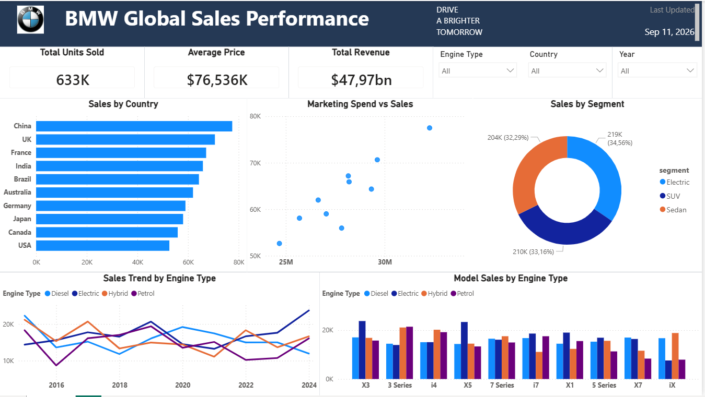

# BMW Global Sales Analysis

## Project Overview
This project analyzes BMW's global sales data using Power BI to identify sales trends, regional performance, model performance, and key business insights.

## Tools Used
- Power BI
- Microsoft Excel
- Power Query
- Data Visualization

## Key Analysis
- Global sales performance
- Sales trends over time
- Regional and country performance
- BMW model performance
- Revenue and sales comparison
- KPI analysis

## Dashboard

## Dataset
The dataset used for this project is included in the project folder.

## Key Insights
Key business insights and findings will be added after reviewing the dashboard.

## Source
Dataset source and credits will be provided here.
